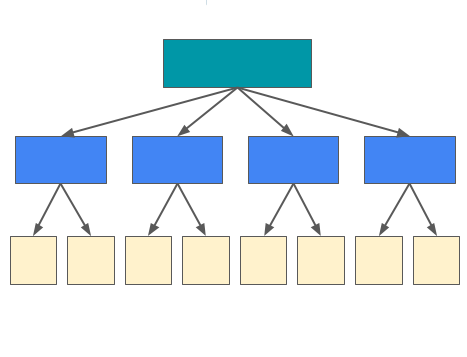

class: middle center

```{r setup, include=FALSE}
knitr::opts_chunk$set(echo = TRUE,
                      comment="")
```

```{r echo=FALSE, message=FALSE}
library(tidyverse)
library(bayesrules)
library(rstanarm)
library(bayesplot)
theme_set(theme_gray(base_size = 18))
```

```{r xaringan-panelset, echo=FALSE}
xaringanExtra::use_panelset()
```


        

.large[`r fontawesome::fa(name = "twitter")`] <a href = "http://twitter.com/MineDogucu">MineDogucu</a>  
.large[`r fontawesome::fa(name = "github")`] <a href = "http://github.com/mdogucu">mdogucu</a>  
.large[`r fontawesome::fa(name = "link")`] <a href = "http://minedogucu.com">minedogucu.com</a>


---

class: middle 

.pull-left[
.center[

 


Alicia Johnson          
.font-20[Macalester College]
        
[`r fontawesome::fa(name = "link")`](https://ajohns24.github.io/portfolio)
[`r fontawesome::fa(name = "github")`](https://github.com/ajohns24)

]
]

.pull-right[
.center[


Miles Ott  
.font-20[Smith College]

[`r fontawesome::fa(name = "link")`](https://milesott.com/)
[`r fontawesome::fa(name = "github")`](https://github.com/MilesOtt)
[`r fontawesome::fa(name = "twitter")`](https://twitter.com/Miles_Ott)

]
]

---

class:center

```{r echo=FALSE, fig.align='center', out.width="25%", fig.alt="a hex shaped logo with shiny green-pink disco ball and purple starry background. There is text that says Bayes Rules!"}
knitr::include_graphics("img/bayes-rules-hex.png")
```


.pull-left[
<script src="https://use.fontawesome.com/releases/v5.15.1/js/all.js" data-auto-replace-svg="nest"></script>

<i class="fas fa-book fa-2x" aria-hidden="true" title="Book icon"></i>

[Bayes Rules! An Introduction to Bayesian Modeling with R](https://bayesrulesbook.com)

]

.pull-right[

<i class="fab fa-r-project fa-2x" aria-hidden="true" title="R logo"></i>

[{bayesrules}](https://www.github.com/bayes-rules/bayesrules)
]


---

class: center middle

### Target Audience of the Talk

.pull-left[

```{r echo=FALSE, fig.align='center', out.width="50%", fig.alt="an illustration of a teacher"}

```
]


--

.pull-right[


```{r echo=FALSE, fig.align='center', out.width="40%", fig.alt="an illustration of a woman climbing stairs"}
knitr::include_graphics("img/climbing-stairs.png")
```
]

---

class: middle 

### Target Audience of the Book


.pull-left[
```{r echo=FALSE, fig.align='center', out.width="100%", fig.alt="an illustration of four students with bags who are holding workbooks."}
knitr::include_graphics("img/student.png")
```

.footnote[<a href="https://www.freepnglogos.com/pics/student">Student from freepnglogos.com</a>]

]

.pull-right[

- Advanced Undergraduate Students in Statistics / Data Science Programs

- Equally trained learners

- Prior course/training in statistics is required

- Familiarity with probability, calculus, and tidyverse is recommended.

]

---

class: middle 

## Our Motivation

- Bayesian methods are becoming more popular due to computing advances and reevaluation of subjectivity.


- Lack of resources for the target audience.


---

class: middle

```{css echo=FALSE}
.panelset {
  --panel-tab-foreground: whitesmoke;
  --panel-tab-active-foreground: whitesmoke;
  --panel-tabs-border-bottom: #00a1a1;
  --panel-tab-inactive-opacity: 0.5;}
```

.panelset.sideways[
.panel[.panel-name[Unit 1]

### Bayesian Foundations

.pull-right[


- Bayes' Rule
- The Beta-Binomial Bayesian Model
- Balance and Sequentiality in Bayesian Analysis
- Conjugate Families

]

.pull-left[

```{r echo=FALSE, fig.align='center', fig.height=3, fig.width=4}
plot_beta_binomial(1, 4, 13, 28) +
  theme(panel.grid = element_blank(),
        axis.title = element_blank(),
        axis.text = element_blank(),
        axis.ticks = element_blank(),
        panel.background = element_blank(),
        legend.position = "none") 
```
]

]

.panel[.panel-name[Unit 2]

### Posterior Simulation & Analysis


.pull-right[

```{r echo=FALSE, fig.align='center', out.width="100%", fig.alt="a traceplot"}
knitr::include_graphics("img/unit2.png")
```


]


.pull-left[

- Grid Approximation

- The Metropolis-Hastings Algorithm

- Posterior Estimation

- Posterior Hypothesis Testing

- Posterior Prediction

]

]


.panel[.panel-name[Unit 3]

### Regression and Classification

.pull-right[

```{r echo=FALSE, fig.align='center', out.width="100%", fig.alt="a traceplot"}
knitr::include_graphics("img/unit3.png")
```

]


.pull-left[

- Normal Regression
- Poisson and Negative Binomial Regression
- Logistic Regression
- Naive Bayes Classification

]
]

.panel[.panel-name[Unit 4]

### Hierarchical Models

.pull-right[

```{r echo=FALSE, fig.align='center', out.width="100%", fig.alt="a traceplot"}

```

]


.pull-left[

- Normal hierarchical models without predictors
- Normal hierarchical models with predictors
- Non-Normal Hierarchical Regression & Classification

]

]

]

---

class: center middle

.large[Pedagogical Approach]


---

class: middle center

## Checking Intuition


```{r echo=FALSE, fig.align='center', out.width="80%", fig.alt="There are two ellipses at the top of the image. The first ellipse reads 'Prior: Only 40% of articles are fake'. The second ellipse reads 'Data: Exclamation points are more common among fake news'. There are two arrows each from the upper two ellipses leading to a third ellipse in the lower part of the image. The third ellipse reads 'Posterior: Is the article fake or not?'"}

```


---


.center[

## Active Learning


.pull-left[

Quizzes

[Quiz Yourself](https://www.bayesrulesbook.com/chapter-1.html#quiz-yourself-1)

```{r echo=FALSE, fig.align='center', out.width="40%", fig.alt="An icon with a question mark and for choices labeled as A, B, C, and D."}
knitr::include_graphics("img/quiz.png")
```

]

.pull-right[

Hands-on Programming


[Metropolis-Hastings Algorithm](https://www.bayesrulesbook.com/chapter-7.html#the-metropolis-hastings-algorithm)

```{r echo=FALSE, fig.align='center', out.width="40%", fig.alt="An icon with two hands typing on the keyboard"}
knitr::include_graphics("img/typing.png")
```

]

]

---

class: center middle

### Computing and Math Together

.pull-left[
<i class="fas fa-laptop-code fa-6x" aria-hidden="true" title="Laptop icon with code"></i>
]

<i class="fas fa-subscript fa-6x" aria-hidden="true" title="X sub 1"></i>


---

class: middle center

.pull-left[

### Compute for a Single Case

```{r echo=FALSE, fig.align='center', out.width="50%", fig.alt="Red bricks on top of each other forming a corner of a wall with a window gap and a tip of a crane hanging from above."}
knitr::include_graphics("img/build.png")
```
]

.pull-right[

### Then Use Built-In Functions

<i class="fab fa-r-project fa-7x" aria-hidden="true" title="R logo"></i>


]


---

class: center middle

## Accessibility and Inclusion


.pull-left[

<i class="fas fa-lock-open fa-6x" aria-hidden="true" title="open lock"></i>

.footnote[More on the topic is available on [DataPedagogy blog](https://www.datapedagogy.com/#category:Bayes_Rules!_book)]

<i class="fas fa-pen fa-6x" aria-hidden="true" title="pen"></i>


]

.pull-right[

<i class="fas fa-blind fa-6x" aria-hidden="true" title="open lock"></i>

<i class="fas fa-table fa-6x" aria-hidden="true" title="table"></i>


]

---

class: center middle

.font-75[R packages]


---

class: middle center

.large[`r fontawesome::fa(name = "github")`] <a href = "http://github.com/bayes-rules/bayesrules">library(bayesrules)</a> 

```{r eval=FALSE}
devtools::install_github("bayes-rules/bayesrules")
```

---

.pull-left[
```{r fig.align='center'}
plot_beta(alpha = 3, beta = 8)
```

]

.pull-right[

```{r fig.align='center'}
plot_beta(alpha = 10, beta = 2)
```

]
---
 
```{r fig.align='center'}
plot_beta_binomial(alpha = 3, beta = 8, y = 19, n = 20)
```

---

```{r, echo=FALSE, message=FALSE, cache=TRUE}
## Code for facet_wrapped Beta-Binomial plots
### Plotting function
beta_binom_grid_plot <- function(data, likelihood = FALSE, posterior = FALSE){
  g <- ggplot(data, aes(x = pi, y = prior)) + 
    geom_line() + 
    geom_area(alpha = 0.5, aes(fill = "prior", x = pi, y = prior)) + 
    scale_fill_manual("", values = c(prior = "#f0e442", 
      `(scaled) likelihood` = "#0071b2", posterior = "#009e74"), breaks = c("prior", "(scaled) likelihood", "posterior")) + 
    labs(x = expression(pi), y = "density") + 
    theme(legend.position="bottom")
  
  if(likelihood == TRUE){
    g <- g + 
      geom_line(aes(x = pi, y = likelihood)) + 
      geom_area(alpha = 0.5, aes(fill = "(scaled) likelihood", x = pi, y = likelihood))
  }
  
  if(posterior == TRUE){
    g <- g + 
      geom_line(aes(x = pi, y = posterior)) + 
      geom_area(alpha = 0.5, aes(fill = "posterior", x = pi, y = posterior)) 
  }
  g
}
make_plot_data <- function(as, bs, xs, ns, labs_prior, labs_likelihood){
  ### Set up data to call in plot
  # Refinement parameter
  size <- 250
  
  # Model settings
  pi <- rep(seq(0,1,length=size), 9)
  
  # Prior parameters
  a <- rep(as, each = size*3)
  b <- rep(bs, each = size*3)
  # Data
  x <- rep(rep(xs, each = size), 3)
  n <- rep(rep(ns, each = size), 3)
  # Posterior parameters
  a_post <- x + a
  b_post <- n - x + b
  # Labels
  setting_prior      <- as.factor(rep(1:3, each = size*3))
  setting_likelihood <- as.factor(rep(rep(1:3, each = size), 3))
  levels(setting_prior)      <- labs_prior
  levels(setting_likelihood) <- labs_likelihood    
  # Prior, likelihood, posterior functions
  bfun1 <- function(x){dbinom(x = xs[1], size = ns[1], prob = x)}
  bfun2 <- function(x){dbinom(x = xs[2], size = ns[2], prob = x)}
  bfun3 <- function(x){dbinom(x = xs[3], size = ns[3], prob = x)}
  scale   <- rep(rep(c(integrate(bfun1, 0, 1)[[1]], integrate(bfun2, 0, 1)[[1]], integrate(bfun3, 0, 1)[[1]]), each = size), 3)
  prior      <- dbeta(x = pi, shape1 = a, shape2 = b)
  likelihood <- dbinom(x = x, size = n, prob = pi) / scale
  posterior  <- dbeta(x = pi, shape1 = a_post, shape2 = b_post)
  # Combine into data frame
  data.frame(setting_prior, setting_likelihood, pi, a, b, x, n, likelihood, prior, posterior)
}
plot_dat <- make_plot_data(
  as = c(5,1,14), bs = c(11,1,1), 
  xs = c(6,29,46), ns = c(13,63,99), 
  labs_prior = c("prior: Beta(5,11)", "prior: Beta(1,1)", "prior: Beta(14,1)"), 
  labs_likelihood = c("data: Y = 6 of n = 13", "data: Y = 29 of n = 63", "data: Y = 46 of n = 99"))
```


```{r echo = FALSE, fig.align='center', cache=TRUE}
plot_dat_new <- plot_dat %>% 
  mutate(setting_prior = factor(setting_prior, 
                                levels = c("prior: Beta(14,1)", "prior: Beta(5,11)", "prior: Beta(1,1)")))
beta_binom_grid_plot(plot_dat_new, posterior = TRUE, likelihood = TRUE) + 
  facet_grid(setting_prior ~ setting_likelihood) +
  theme(text = element_text(size=17)) 
```


---

class: middle

.pull-left[
### Plotting Functions

`plot_beta()`   
`plot_binomial_likelihood()`  
`plot_beta_binomial`  

`plot_gamma()`  
`plot_poisson_likelihood()`  
`plot_gamma_poisson()`  

`plot_normal()`  
`plot_normal_likelihood()`  
`plot_normal_normal()`  

]

.pull-right[

### Summary Functions

`summarize_beta()`
`summarize_beta_binomial()`  

<br>

`summarize_gamma()`
`summarize_gamma_poisson()`  

<br>


`summarize_normal_normal()`


]

---

class: middle

## Model Evaluation Functions

| Functions                                                        | Response     | Model Type |
|------------------------------------------------------------------|--------------|------------|
| `prediction_summary()` <br> `prediction_summary_cv()`                     | Quantitative | rstanreg   |
| `classification_summary()` `classification_summary_cv()`             | Binary       | rstanreg   |
| `naive_classification_summary()` `naive_classification_summary_cv()` | Categorical  | naiveBayes |


---

## Prediction Summary


```{r echo=FALSE, cache=TRUE}
data <- data.frame(x = sample(1:100, 20)) 
data$y <- data$x*3 + rnorm(20, 0, 5)
model <- rstanarm::stan_glm(y ~ x,  data =data, refresh = FALSE, seed=84735)
```

.pull-left[
```{r cache=TRUE}
prediction_summary(model, data, 
                   prob_inner = 0.6, 
                   prob_outer = 0.80, 
                   stable = TRUE)
```

]

--

.pull-right[


```{r cache=TRUE}
prediction_summary_cv(model = model, 
                      data = data, 
                      k = 2, #<<
                      prob_inner = 0.6, 
                      prob_outer = 0.80)
```

]

---

class: middle

## `library(rstan)`


.pull-left[
```{r}
# STEP 1: DEFINE the model
stan_bike_model <- "
  data {
    int<lower=0> n;
    vector[n] Y;
    vector[n] X;
  }
  parameters {
    real beta0;
    real beta1;
    real<lower=0> sigma;
  }
  model {
    Y ~ normal(beta0 + beta1 * X, sigma);
  }
"
```

]


.pull-right[

```{r eval=FALSE}
# STEP 2: SIMULATE the posterior
stan_bike_sim <- 
  stan(model_code = stan_bike_model, 
  data = list(n = nrow(bikes), 
              Y = bikes$rides, X = bikes$temp_feel), 
  chains = 4, iter = 5000*2, seed = 84735)
```

]

---

class: middle

## `library(rstanarm)`


```{r eval=FALSE}
normal_model_sim <- stan_glm(rides ~ temp_feel, 
                             data = bikes, 
                             family = gaussian, 
                             chains = 4, iter = 5000*2,
                             seed = 84735)
```

```{r cache=TRUE, echo=FALSE}
normal_model_sim <- 
  stan_glm(rides ~ temp_feel, 
           data = bikes, 
           family = gaussian, 
           chains = 4, iter = 5000*2,
           seed = 84735,
           refresh = FALSE)
```

---

### `library(bayesplot)`

.pull-left[
```{r out.width = "80%", fig.align='center'}
mcmc_trace(normal_model_sim, size = 0.1)
```

]

.pull-right[

```{r out.width = "80%", fig.align='center'}
mcmc_dens_overlay(normal_model_sim)
```
]


---


class: middle

## Resources

- [Undergraduate Bayesian Education Resources](https://undergrad-bayes.netlify.app/)

--

- [Undergraduate Bayesian Education Network](https://undergrad-bayes.netlify.app/network.html)

--

- [STATS 115 at UC Irvine](https://www.stats115.com)

---

class: middle center

Questions?

[bit.ly/dogucu-talks](https://bit.ly/dogucu-talks)
